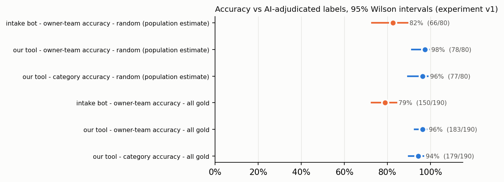
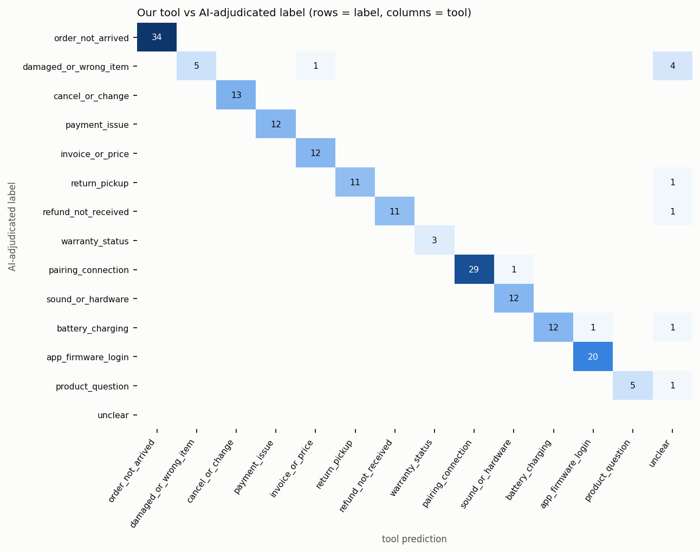

# Validation of the ticket categoriser

> **Read this first.** There are no human ground-truth labels for this data. Every "correct" label below was
> **assigned by the AI (Claude), not by a person**. The labels are best described as AI-adjudicated. The same AI also
> designed the taxonomy and wrote the categoriser's rules, so the labels and the tool can share blind spots. Treat
> every accuracy figure here as an **upper-bound estimate**, good enough to compare the tool with the intake bot and
> to find failure modes. It is not proof of real-world accuracy. A proper human study is described at the end.

**Re-run everything:**

```bash
python -m src.validate --tag v1
```

```bash
python -m src.validate --tag v2
```

```bash
python -m src.compare_versions --tag v2
```

Console output is saved in [outputs/validation_output.txt](../outputs/validation_output.txt) (experiment 1) and
[outputs/validation_output_v2.txt](../outputs/validation_output_v2.txt) (experiment 2).

---

## 1. Headline

| | Experiment 1 (held-out, tool v1) | Experiment 2 (fresh sample, tool v2) |
|---|---:|---:|
| Gold tickets | 190 | 120 |
| **Tool category accuracy, random stratum** (population estimate) | **96.2%** (77/80, CI 89.5–98.7) | **96.7%** (58/60, CI 88.6–99.1) |
| Tool category accuracy, all gold (hard cases oversampled) | 94.2% (179/190, CI 89.9–96.7) | 92.5% (111/120, CI 86.4–96.0) |
| Tool error rate, all gold | 5.8% | 7.5% |
| **Tool owner-team accuracy**, all gold | **96.3%** (183/190, CI 92.6–98.2) | **95.8%** (115/120, CI 90.6–98.2) |
| **Intake bot owner-team accuracy**, all gold | **78.9%** (150/190, CI 72.6–84.1) | **69.2%** (83/120, CI 60.4–76.7) |
| Intake bot owner-team accuracy, random stratum | 82.5% (66/80, CI 72.7–89.3) | 81.7% (49/60, CI 70.1–89.4) |
| Intake bot category-compatible (lenient), all gold | 62.6% (119/190) | 56.7% (68/120) |
| Wrong-owner ("costly") tool errors | 7 of 190 | 5 of 120 |

CI = 95% Wilson score interval. Charts: [validation_accuracy.png](../outputs/validation_accuracy.png),
[validation_accuracy_v2.png](../outputs/validation_accuracy_v2.png).



---

## 2. Method

### 2.1 Taxonomy used
The 13 approved categories plus *Unclear*, with owners, are defined in [vireo/taxonomy.py](../vireo/taxonomy.py).

| Owner | Categories |
|---|---|
| Logistics | Order not arrived; Damaged or wrong item received |
| Billing | Payment taken, no order / charged twice; Invoice, GST or price/discount |
| Returns Desk | Return pickup not done; Refund not received |
| Escalations & Warranty (Tier 2) | Warranty or repair status |
| Frontline (Chat, Email or Voice, by channel) | Cancel or change an order; Pairing & connection; Sound, mic or hardware fault; Battery & charging; App, firmware or login; Product question; Unclear |

### 2.2 Dev, test and "training" separation

| Set | Size | Used for | Never used for |
|---|---:|---|---|
| **Dev**: [labels/taxonomy_sample200.csv](../labels/taxonomy_sample200.csv) | 208 | Designing the taxonomy and writing and tuning the rules (v1) | Any reported accuracy |
| **TF-IDF training** | rule-confident rows of the input | The TF-IDF stage trains at run time on messages the *rules* labelled with ≥0.8 confidence. No gold label is ever used. | |
| **Gold v1** (test 1): [labels/gold_v1_*](../labels/) | 190 | Experiment 1, the held-out score for frozen tool v1 | Its errors later motivated v2, so it is **not** valid evidence for v2 |
| **Gold v2** (test 2): [labels/gold_v2_*](../labels/) | 120 | Experiment 2, the score for frozen tool v2. Drawn after v2 was frozen; excludes dev, gold v1 and 30 tickets viewed while building v2 ([labels/viewed_during_v2_dev.csv](../labels/viewed_during_v2_dev.csv)) | |

**Freeze order, from git history:**
1. Categoriser v1 frozen: `52f8a5e`.
2. Gold v1 drawn, labelled and committed: `b48abb5`.
3. Experiment 1 scored, unchanged: `f58c0ca`.
4. Rules v2 frozen: `f7d0830`.
5. Gold v2 drawn, labelled and committed: `55000b3`.
6. Experiment 2 scored.

Each experiment re-runs with the rules that were frozen for it. v1 is kept as a byte-identical copy in
[validation_archive/rules_v1.py](../validation_archive/rules_v1.py).

### 2.3 Sample selection ([src/gold_sample.py](../src/gold_sample.py), seeded)
- **Pool:** the cleaned analysis view (11,641 tickets, Jan 2025 – Jun 2026), minus the dev set.
- **Strata, filled in order:**
  - **random** (80 / 60): a simple random sample. **This is the only stratum that estimates population accuracy.**
  - hard cases (110 / 60):
    - *bot_disagree*: the tool says the bot's tag is wrong
    - *hinglish*: Hinglish markers
    - *short*: 6 words or fewer
    - *voice*: IVR transcripts
    - *multi_issue*: the tool saw strong evidence for 2+ categories
    - *low_conf*: tool confidence below 0.8
    - *paid_but*: payment and delivery words together
- Some hard-case strata are selected *using the tool's own flags*. That makes them deliberately hard for the tool, so the "all gold" figures are pessimistic compared with the population.
- Per-stratum results are in [validation_results.csv](../outputs/validation_results.csv) and [validation_results_v2.csv](../outputs/validation_results_v2.csv).

### 2.4 How labels were adjudicated
- **Blind:** each ticket was read with **only its channel and customer message** visible. The bot tag, the tool's prediction, agent notes, resolving team and stratum were hidden, and the order was shuffled ([labels/gold_v1_blind.csv](../labels/gold_v1_blind.csv)).
- **Rules, fixed before reading:**
  - Label the customer's primary need and ignore closing demands ("I want my money back").
  - Multi-issue: take the first concrete problem unless another is clearly the main ask.
  - "Paid but not arrived" is *Order not arrived*; "paid but no order exists" is *Payment*.
  - A device fault is the fault category unless a repair or claim is already open.
  - *Unclear* only when no concrete issue is stated.
- **Ambiguity:** ambiguous items are flagged with a note (8 in v1, 5 in v2; column `ambiguous`).
- **No changes after scoring:** labels were committed before any scoring and have not been edited since.

### 2.5 Explicit limitation of AI labels
- **Shared blind spots:** the labeller and the rule-writer are the same AI. A message whose wording the AI reads one way will tend to be labelled *and* classified that way, so agreement is inflated. That matters most on ambiguous items.
- **Optimistic test:** the messages are built from recurring stock phrases (430 rows share an exact text; audit #3). A rule system that learns those phrases looks strong. Unseen phrasings are where it fails (§4), and a real export would have more of them.
- **One labeller:** no inter-annotator agreement could be measured.

---

## 3. Results

### 3.1 Per category, experiment 1 ([validation_per_category.csv](../outputs/validation_per_category.csv))

| Category | Gold n | Precision | Recall | F1 |
|---|---:|---:|---:|---:|
| Order not arrived | 34 | 1.00 | 1.00 | 1.00 |
| Damaged or wrong item | 10 | 1.00 | **0.50** | 0.67 |
| Cancel or change | 13 | 1.00 | 1.00 | 1.00 |
| Payment / charged twice | 12 | 1.00 | 1.00 | 1.00 |
| Invoice, GST, price | 12 | 0.92 | 1.00 | 0.96 |
| Return pickup | 12 | 1.00 | 0.92 | 0.96 |
| Refund not received | 12 | 1.00 | 0.92 | 0.96 |
| Warranty status | 3 | 1.00 | 1.00 | 1.00 |
| Pairing & connection | 30 | 1.00 | 0.97 | 0.98 |
| Sound / hardware | 12 | 0.92 | 1.00 | 0.96 |
| Battery & charging | 14 | 1.00 | 0.86 | 0.92 |
| App, firmware, login | 20 | 0.95 | 1.00 | 0.98 |
| Product question | 6 | 1.00 | 0.83 | 0.91 |

**Experiment 2** ([validation_per_category_v2.csv](../outputs/validation_per_category_v2.csv)):
- Every category has precision of at least 0.90.
- Lowest recalls are *Return pickup* 0.50 (2 of 4), *Sound / hardware* 0.85, *Damaged or wrong item* 0.88 (up from 0.50 in v1) and *Battery* 0.90.
- Counts for Warranty (3–4), Product question (3–6) and Payment (5 in v2) are too small for per-category rates to mean much.

### 3.2 Confusion matrices
- Tool: [validation_confusion_tool.png](../outputs/validation_confusion_tool.png) and [`_v2`](../outputs/validation_confusion_tool_v2.png).
- Bot: [validation_confusion_bot.png](../outputs/validation_confusion_bot.png) and [`_v2`](../outputs/validation_confusion_bot_v2.png).



- **The tool's matrix is almost diagonal.** Off-diagonal mass sits in the *Unclear* column: the tool abstains rather than guessing.
- **The bot's matrix shows the routing problem directly.** Of the gold tickets the bot tagged *Billing & Payments*, 17 of 38 in experiment 1 are really *Order not arrived*.

### 3.3 Hard cases (tool category accuracy | tool owner accuracy | bot owner accuracy)

| Subset | Experiment 1 | Experiment 2 |
|---|---|---|
| bot_disagree stratum | 92% \| 100% \| 52% (n=25) | 100% \| 100% \| 20% (n=15) |
| paid_but stratum (core Billing/Logistics ambiguity) | 100% \| 100% \| **30%** (n=10) | 80% \| 80% \| **20%** (n=5) |
| any Hinglish | 93% \| 96% \| 70% (n=27) | 91% \| 91% \| 82% (n=11) |
| any short (≤6 words) | 100% \| 100% \| 91% (n=22) | 100% \| 100% \| 82% (n=17) |
| any voice / IVR | 92% \| 95% \| 89% (n=38) | 88% \| 100% \| 81% (n=26) |
| multi_issue stratum | 93% \| 93% \| 100% (n=15) | 88% \| 88% \| 62% (n=8) |
| low_conf stratum | **67%** \| 73% \| 87% (n=15) | 88% \| 100% \| 50% (n=8) |
| ambiguous (per labeller) | 75% \| 88% \| 75% (n=8) | **40%** \| 80% \| 80% (n=5) |

Stratum sizes are small: a single ticket moves a rate by 7–20 points.

### 3.4 Comparing the original bot with our tool, on the same tickets
- **Experiment 1 owner team:**
  - Both right: 144. Tool fixes the bot: 39. Tool breaks the bot: 6. Both wrong: 1.
  - Of the bot's 40 wrong-owner tickets, 17 were delivery problems sent to Billing; the tool fixes 39 of the 40.
  - Of the 6 tickets the tool gets wrong where the bot was right, 5 are abstentions (the tool says *Unclear* → Frontline) and 1 is TK-243926 (wrong item → *Invoice*).
- **Experiment 2:** the tool fixes 35 of the bot's 37 owner errors and breaks 3.
- Files: [validation_bot_vs_tool_owner.csv](../outputs/validation_bot_vs_tool_owner.csv), [`_v2`](../outputs/validation_bot_vs_tool_owner_v2.csv).

---

## 4. The actual wrong cases

Experiment 1 had 11 errors and experiment 2 had 9 (full lists: [validation_errors.csv](../outputs/validation_errors.csv),
[validation_errors_v2.csv](../outputs/validation_errors_v2.csv)).

| Error type | Exp 1 | Exp 2 | Examples (ticket, message → tool) |
|---|---:|---:|---|
| **Abstained (Unclear)** | 8 | 8 | TK-247809 "wrong product delivered. i already chcked the invoice" → Unclear (tie with invoice). TK-254294 "[IVR] got a different colour than ordered" → Unclear (phrase not covered in v1). TK-252089 "keeps losing my phone if i walk to the other room" → Unclear (exp 2). TK-243982 "packed the box a week ago & it's still here" → Unclear (exp 2). |
| **Delivery labelled as Billing** | 1 | 0 | TK-243926 "wrong product delivered. i checked the invoice" → *Invoice* (TF-IDF 0.52) |
| Device-fault confusion (same Frontline owner) | 2 | 0 | TK-252434 "sound stutters whenever my phone is in my pocket" → *Sound* (gold: *Pairing*, flagged ambiguous). TK-253877 "promised 40 hours… I get maybe 2" → *App* (TF-IDF 0.56) |
| Other | 0 | 1 | TK-249565 "a dent on the case straight out of the box" → *Battery* (TF-IDF 0.50): "case" read as the charging case |
| Payment/refund confusion | 0 | 0 | |
| Cancel/change confusion | 0 | 0 | |

### Costly errors (wrong owner team)
- **Tool:** 7 of 190 in experiment 1 (3.7%) and 5 of 120 in experiment 2 (4.2%). A wrong owner means a likely transfer (Rs 305, policy §4) plus breach risk.
- **Bot:** 40 of 190 and 37 of 120 wrong-owner tickets on the same samples.
- **Most costly tool errors are abstentions on Logistics or Returns work:** wrong item, missed pickup, unarrived order. Offline, *Unclear* defaults to Frontline, which then has to transfer. The optional LLM stage exists for exactly these (not run; see §6).
- **Errors within the same owner** (e.g. sound vs pairing) cost nothing in routing.

### Specific failure areas asked about
- **Delivery tickets classified as Billing:**
  - Gold: 1 of 44 delivery tickets in v1 and 0 of 33 in v2.
  - Population weak check (§5): 35 of 921 Billing-tagged tickets whose agent notes describe delivery work are *not* put in a delivery category by the tool (v1), and 20 put in delivery have non-delivery notes.
  - This is the most important error for the business question, and it is rare.
- **Payment/refund confusion:** none in 310 gold tickets. The precedence rule (a refund for a double charge → *Payment*) never had to fire on a contested gold case, so it is untested.
- **Cancel/change confusion:** none. "Ordered the wrong colour, don't ship it" (cancel) vs "got a different colour" (wrong item) is handled in v2; v1 missed the second.
- **Multi-issue tickets:** genuinely two-problem messages are rare in this data. The tool's `multi_issue` flag mostly fires on one issue plus a Tried-step, e.g. "wrong item… I checked the invoice". Accuracy on that stratum is 93% / 88%.
- **Ambiguous tickets:** this is where the tool and the label diverge most (75% / 40%). By construction these are also where an AI label is least trustworthy.
- **Hinglish and short messages:** strong (91–100%). Hinglish fillers are stripped, and short messages tend to be stock phrases.
- **Voice:** the weakest experiment-2 stratum (5/8). IVR transcripts paraphrase more ("one of them is just decoration", "plugging in does nothing on the case").

---

## 5. Weak operational check: agent notes and resolving team

> **These are weak proxies, not ground truth.** The resolving team mostly reflects where the bot sent the ticket and who
> happened to pick it up. Agent notes are free text read by another rule set that I also wrote ([src/routing.py](../src/routing.py)).
> They are independent of the *customer message*, which is all the tool reads, but not independent of the author.

| Check | Experiment 1 | Experiment 2 |
|---|---:|---:|
| Billing-tagged population: tool puts it in a delivery category when notes describe delivery work (recall) | 96.2% (886/921) | 96.1% (885/921) |
| Billing-tagged population: notes describe delivery work when the tool says delivery (precision) | 97.8% (886/906) | 97.8% (885/905) |
| Gold: tool owner family = resolver family | 75.8% | 74.2% |
| Gold: **AI label** owner family = resolver family | 78.9% | 78.3% |
| Gold: bot team family = resolver family | 89.5% | 83.3% |
| Population: tool owner family = resolver family | 79.5% | 80.7% |
| Population: bot team family = resolver family | 88.4% | 88.4% |

How to read this:
- **The notes check is the meaningful one.** On the 2,425 Billing-tagged tickets, agents' own after-the-fact notes agree with the tool's delivery/not-delivery call about 96–98% of the time, without the tool ever seeing the notes.
- **The resolver-team agreement is *expected* to be lower for the tool than for the bot.** The resolver is largely a consequence of the bot's routing: Billing agents handle 261 delivery tickets themselves (stage 2, F4), and Frontline resolves cancellations. Even the AI gold label agrees with the resolver only 78–79%, about the same as the tool. So this proxy measures agreement with current practice, which is exactly what the tool is meant to change, and it can't rank the tool against the bot.

---

## 6. Experiment 2: a post-test improvement, evaluated separately

**What changed (rules v2, `f7d0830`):** all four changes were motivated by experiment-1 errors.
1. Strip the Tried-step "I checked/rechecked the invoice / my order".
2. Add wrong-colour and "got something else" phrases to *Damaged or wrong item*.
3. Add "promised N hours… I get maybe 2" to *Battery*.
4. Fix typos of "return".

A broader version of change 1, which stripped *every* "I tried/checked…" step, was tried and **discarded**: it turned about 150 tickets *Unclear* by deleting real evidence ("I checked mic permissions").

**Result on the fresh gold v2, which neither version saw** ([validation_version_comparison_v2.csv](../outputs/validation_version_comparison_v2.csv)):

| Rules | Category accuracy | Owner accuracy | Unclear |
|---|---:|---:|---:|
| v1 (frozen) | 90.8% (109/120, CI 84.3–94.8) | 94.2% | 6.7% |
| v2 (frozen) | 92.5% (111/120, CI 86.4–96.0) | 95.8% | 6.7% |

- **v2's gain on fresh data is 2 tickets, inside the noise.** The fixes worked on what they targeted: *Damaged or wrong item* recall went from 0.50 to 0.88. But new paraphrases took their place as abstentions.
- On gold v1, v2 scores 98.4%. **That number is not evidence:** v2 was built from gold v1's errors. It appears only in [validation_version_comparison_v1.txt](../outputs/validation_version_comparison_v1.txt), labelled as contaminated.
- **Two independent held-out estimates for v1** (gold v1 and gold v2): 94.2% and 90.8% on all gold, so roughly 91–94%. On the random strata, v1 scored 96.2%.
- **The lesson:** rules plateau at around 92–96% here, and the remaining errors are a long tail of unseen phrasings. More rules is the wrong fix. The right next step is the LLM fallback for the roughly 4% *Unclear* (456 of 11,780 tickets in the full run), measured on a fresh sample.
- **LLM mode was not run.** No API calls have been made and no money spent; it is built, cached and cost-logged, and unit-tested with a fake client only.

---

## 7. Is this strong enough to use?

**Strong enough to:**
- compare the tool with the intake bot: the routing gap (about 96% vs 69–79% owner accuracy on the same tickets) is far outside the confidence intervals;
- support the stage-2 finding that roughly 38% of Billing's queue is delivery work, since the tool, the agent notes and the AI labels all agree.

**Not strong enough to:**
- quote "96% accurate" to the client as a measured fact;
- set per-category SLAs;
- claim the tool beats a careful human.

## 8. What a proper human-labelled validation would need
1. **Labellers:** two or more Vireo CX agents (ideally one each from Billing, Logistics and Frontline), working from a one-page written guideline and these 13 definitions, blind to bot tag, notes and tool output.
2. **Sample:** about 400 tickets: 250 random from the most recent quarter, which gives roughly ±2.5–3 points at 95% near 95% accuracy, plus 150 hard cases. Include at least 20 per category for per-category recall.
3. **Agreement:** measure inter-annotator agreement (Cohen's κ; target ≥0.8) before scoring. Adjudicate disagreements with a third person and keep both raw labels.
4. **Owner too:** label the owner team, not just the category, because routing is the decision that costs money.
5. **Freeze:** commit labels before scoring, exactly as here, and keep a never-touched test set for every new version.
6. **Repeat:** re-validate on a new random sample each quarter or after any change to the bot's intake questions.
