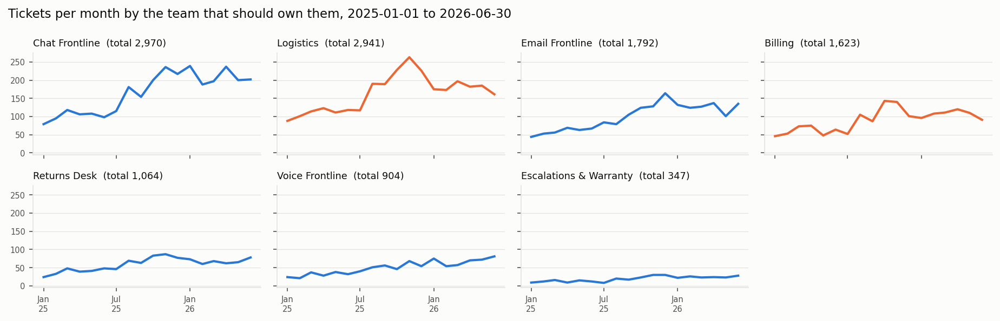

# Memo: Support headcount and ticket routing

**To:** Priya Raman · **Re:** two hires for "whichever team is biggest"

## 1. The answer
The data does not support putting the two hires into Billing: over a third of Billing's queue is delivery work that the intake bot sends to the wrong team. Fix that routing first and hold the hires until the true ticket volume is confirmed; if hires are needed, the evidence points to Logistics.

## 2. The number and what it is worth
**Cut delivery problems landing in Billing's queue from 34.9% of Billing's tickets to about 2.1%, worth about Rs 36,587 a quarter (range Rs 22,689 to Rs 53,146).**

- **Measured:** from January to June 2026, 314 of 900 Billing tickets were really "where is my order" problems. Each averaged 0.904 transfers, against 0.088 when the bot sent them straight to Logistics.
- **Calculated:** routing on the customer's own words removes most of those extra transfers, at the policy's Rs 305 each. That is a planning cost, mostly agent time, not cash.
- **Left out:** breach credits (Rs 14,435 a quarter), to avoid double counting the same tickets.

## 3. The two hires
I know these were half-promised to Billing, so plainly:
- **Billing vs Logistics.** Counted by the work each team actually owns, Billing's agents use 26% of their available hours and Logistics' 44%. Billing looks biggest only because it receives Logistics' work.
- **Now:** don't commit the hires to Billing; fix the routing.
  - It costs nothing to run; building it in is not yet costed.
  - At Rs 1,46,347 a year (16.3% of the two hires), it is not a substitute for people.
  - Little work moves: only 92 of the 314 were finished by Billing. The change is about 0.39 of one agent.
- **Before committing:** confirm volume, then run the new routing alongside the bot and compare transfers and breaches. Unclear messages (5.6%) keep today's routing.
- **If volume is really 650 a week:** Logistics would be at 158% of capacity and Billing at 93%. The hires should go to Logistics.

## 4. What I am not sure about, and how I checked
- **Volume.** The export holds 181.6 tickets a week; the form assumes 650 (3.58x). All figures use the export. At 650 the saving would be about Rs 1,30,955 a quarter (estimate only).
- **Who checked.** Against agents' closing notes, the routing catches 96.1% of misrouted delivery tickets and wrongly moves 1.33% of billing ones. On samples labelled by AI, not staff, it chose the right team 96% of the time against 69%-79% for the bot.
- **So:** strong estimates, not guaranteed results, until a live trial. Every figure re-runs from the raw files; automated checks pass on a fresh machine.

## 5. One next step
Ask Sameer today whether our export contains every ticket the helpdesk received. That answer decides whether, and where, the hires go.

*Counted by the team that should own the work, Logistics handled more tickets than Billing in every one of the last 18 months.*

